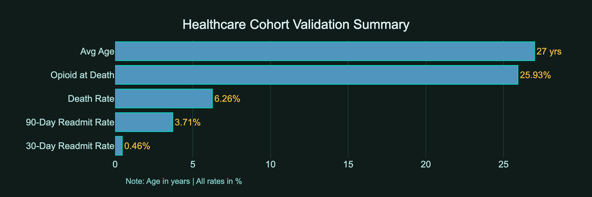

# Healthcare Analytics - Clinical Cohort Construction in SQL
[](https://opensource.org/licenses/MIT)
[](https://github.com/space-lumps/healthcare-analytics-sql/actions/workflows/sql-pipeline-smoke.yml)
[](https://github.com/space-lumps/healthcare-analytics-sql/actions/workflows/sql-pipeline-validation.yml)
[](https://duckdb.org/)
[](https://github.com/space-lumps/healthcare-analytics-sql/releases/latest)



## Table of Contents

- [Healthcare Analytics - Clinical Cohort Construction in SQL](#healthcare-analytics---clinical-cohort-construction-in-sql)
  - [Table of Contents](#table-of-contents)
    - [Overview](#overview)
    - [Objective](#objective)
    - [Cohort Definition](#cohort-definition)
    - [Metrics \& Features Produced](#metrics--features-produced)
    - [Validation \& QA](#validation--qa)
    - [Continuous Integration](#continuous-integration)
      - [1. Smoke Pipeline Checks (`sql-pipeline-smoke.yml`)](#1-smoke-pipeline-checks-sql-pipeline-smokeyml)
      - [2. Full Validation Pipeline (`sql-pipeline-validation.yml`)](#2-full-validation-pipeline-sql-pipeline-validationyml)
    - [Repository Structure](#repository-structure)
    - [How to Run](#how-to-run)
    - [Data](#data)
    - [Design Philosophy](#design-philosophy)
    - [Key Takeaways \& Lessons Learned](#key-takeaways--lessons-learned)
    - [License](#license)

---

### Overview

This repository implements a **reproducible analytics-engineering workflow** for healthcare encounter data using SQL. The project focuses on constructing a clinically meaningful cohort, deriving encounter-level metrics, and validating results with explicit QA tests.

The end result is an **analysis-ready cohort table** at a clear grain (`patient_id + encounter_id`) that can be safely used downstream for reporting, modeling, or further analysis.

---

### Objective

* Define a drug overdose hospital encounter cohort using explicit clinical and demographic criteria
* Engineer encounter-level features commonly used in healthcare analytics
* Validate complex logic (e.g., readmissions, age calculation) with standalone test queries
* Demonstrate production-style SQL organization, normalization, and quality checks

---

### Cohort Definition

The cohort includes hospital encounters that meet all of the following:

* `encounters.encounter_reason = 'Drug overdose'`
* Encounter start date after **1999-07-15**
* Patient age at encounter between **18 and 35** (inclusive, birthday-accurate calculation)

The cohort is built as a **TEMP VIEW** to support iterative analysis and validation.

---

### Metrics & Features Produced

Each row represents **one patient encounter** and includes:

* `death_at_visit_ind`  
  Indicator for death occurring during the encounter window

* `count_current_meds`  
  Count of medications active at encounter start

* `current_opioid_ind`  
  Indicator for active opioid medications at encounter start

* `readmission_90_day_ind`  
  Indicator for overdose readmission within 90 days

* `readmission_30_day_ind`  
  Indicator for overdose readmission within 30 days

* `first_readmission_date`  
  Date of first qualifying readmission, if any

All metrics are derived explicitly in SQL with documented assumptions and tested constraints.

---

### Validation & QA

The repo includes **dedicated validation queries** to verify correctness of key logic, including:

* Independent recalculation of readmission indicators  
* Comparison of age calculation methods (year-diff vs birthday-accurate)  
* Validation that readmission counts are unaffected by cohort-side age filtering  
* Duplicate grain checks (`patient_id + encounter_id`)  
* Source reconciliation and join fanout checks  
* Null and range validation tests  

Key validated findings include:

* `encounters.id` is unique (no encounter-level deduplication required)
* `encounters.stop` contains no null values (validated during QA)
* Expanding readmission logic beyond the age-filtered cohort produced identical results in the production and sample datasets
* Medication deduplication was required and handled during normalization

Validation logic lives alongside the pipeline and can be run independently.
Validation summary is documented in `docs/validation_summar.md`
* Tests with the `recon` prefix independently recompute cohort-selection logic before downstream schema and metric validation.

---

### Continuous Integration

This repository uses **GitHub Actions** to automatically validate the SQL pipeline on pushes to `main` or `refactor/*` branches, and on pull requests targeting `main`. Two complementary workflows provide layered protection: quick syntax/output checks for speed, and deeper data quality validation for confidence.

Two complementary workflows are defined in `.github/workflows/`:

#### 1. Smoke Pipeline Checks (`sql-pipeline-smoke.yml`)

This lightweight workflow runs on every relevant push and pull request, and serves as a fast "does it still build and produce output?" gate.

- **Build & Schema Check** — Executes the full pipeline (normalization → cohort building → feature derivation) in a clean DuckDB environment and verifies that:
  - All SQL scripts parse without syntax errors
  - Expected tables/views are created with the correct schema (column names, types, grain)

- **Validate Output CSV** — Confirms that the final output CSV is generated successfully and contains the expected columns/structure (basic row count and header validation).

Purpose: Detect breaking changes quickly so feedback arrives early in development or review cycles.

#### 2. Full Validation Pipeline (`sql-pipeline-validation.yml`)

This more comprehensive workflow is also triggered by the same events (and can be manually dispatched if needed). It focuses on deep data quality assurance.

- **Data Quality Checks** — Executes nearly all SQL test queries located in `sql/pipeline/tests/` **in serial** (one after another) against the pipeline output.  
  - Executes the automated data quality tests from `sql/pipeline/tests/` against the pipeline output  
  (includes grain/consistency checks, source-to-derived reconciliation, null & duplicate scans, and key business logic validations such as readmission flags and age calculations)
  - Excludes `40_final_sanity.sql`, which remains reserved for manual / ad-hoc review

**Purpose:** Ensures core analytics logic, feature derivations, and data invariants stay correct through refactors, logic updates, or schema changes.

Together, these workflows enforce deterministic, testable SQL practices and help deliver production-grade reliability in an open-source healthcare analytics project.

---

### Repository Structure

```text
.
├─ sql/
│  ├─ explore/
│  │  ├─ 01_source_files_exploration.sql
│  │  └─ 02_source_files_exploration_NA.sql
│  └─ pipeline/
│     ├─ 10_normalize_sources.sql
│     ├─ 20_build_cohort.sql
│     ├─ 30_output_csv.sql
│     └─ tests/
│        ├─ 00_recon_expected.sql
│        ├─ 01_recon_unexpected.sql
│        ├─ 02_recon_counts.sql
│        ├─ 03_recon_fanout.sql
│        ├─ 10_schema.sql
│        ├─ 11_grain.sql
│        ├─ 20_cohort_criteria.sql
│        ├─ 30_metric_logic.sql
│        ├─ 31_nulls_ranges.sql
│        └─ 40_final_sanity.sql
│
├─ datasets/
│  ├─ prod/       (gitignored)
│  └─ sample/
│     ├─ encounters.csv
│     ├─ medications.csv
│     └─ patients.csv
│
├─ docs/
│  ├─ assumptions.md
│  ├─ run_instructions.md
│  ├─ validation_summary.md
│  └─ data-dictionary-csvs/
│
├─ output/        (gitignored)
│
└─ README.md
```

---

### How to Run

* SQL engine: **DuckDB**
* DuckDB must be started from `sql/pipeline/` for relative paths to resolve correctly
* Scripts are numbered and must be executed in order
* `10_normalize_sources.sql` must be executed before `20_build_cohort.sql`, followed by `30_output_csv.sql`
* Validation tests can be run after the cohort TEMP VIEW is created

Detailed environment setup and execution instructions are documented in `docs/run_instructions.md`.


---
### Data

Raw source files are not committed to this repository. The project separates local production inputs from reproducible sample data:

- `datasets/prod/`  
  Local, production-scale source files (gitignored).

- `datasets/sample/`  
  Synthetic sample CSVs included to make the pipeline runnable and to exercise key edge cases.

Notes:
- Raw encounter timestamps are stored as UTC in the source data and preserved as TIMESTAMP during normalization to maintain full temporal precision.
- The pipeline operates on normalized DuckDB TEMP VIEWs generated by `10_normalize_sources.sql`.
- Tested constraints, assumptions, and validation findings are documented in `/docs`.
- Switch between `datasets/sample/` and `datasets/prod/` by updating the `dataset_root()` macro at the top of `10_normalize_sources.sql`.

---

### Design Philosophy

This project follows analytics engineering best practices:

* Explicit grain definition  
* Deterministic business logic  
* Separation of normalization and feature engineering  
* Independent QA validation  
* Documented assumptions and tested constraints  

These principles ensure the pipeline is reproducible, auditable, and production-like, mirroring workflows in healthcare and clinical data teams.

### Key Takeaways & Lessons Learned

- **Dedicated QA/validation is non-negotiable** — Writing standalone test queries for critical logic (age calculation, readmission flags, grain integrity) catches subtle bugs that simple counts miss and builds confidence for downstream use.
- **Modular, numbered SQL files enhance debuggability** — Sequencing scripts (10_normalize → 20_cohort → 30_output + tests/) allows independent execution, easier troubleshooting, and clearer collaboration compared to monolithic queries.
- **DuckDB excels for local prototyping** — Running full pipelines on sample data with near-production SQL syntax enables rapid iteration without spinning up a database server or dealing with connection overhead.
- **Transparent documentation of assumptions prevents misinterpretation** — Maintaining a separate assumptions.md file (plus inline comments) clarifies scope, edge cases, and design decisions for reviewers or future self.
- **Cohort logic is the foundation** — Investing upfront in precise, reproducible cohort definition avoids propagating errors through feature derivation and metrics.

---

### License

MIT License  
Copyright (c) 2026 Corin Stedman  

This project is licensed under the MIT License - see the [LICENSE](LICENSE) file for details.